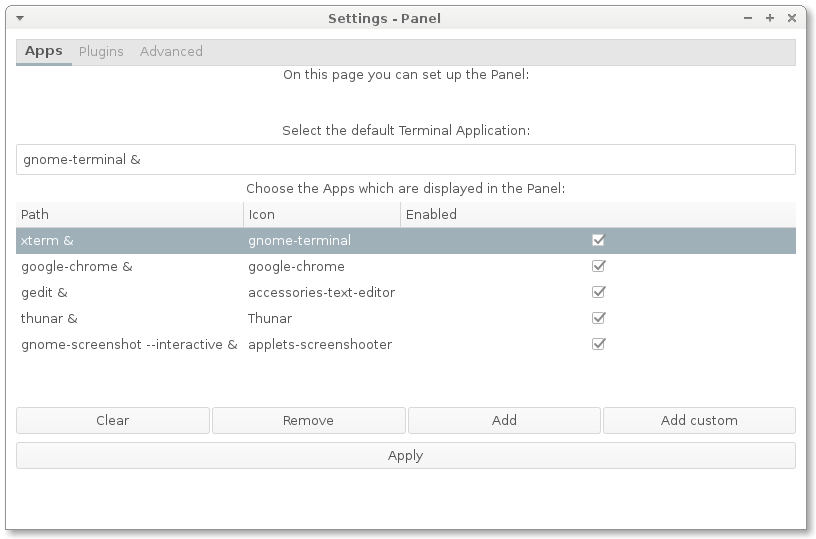
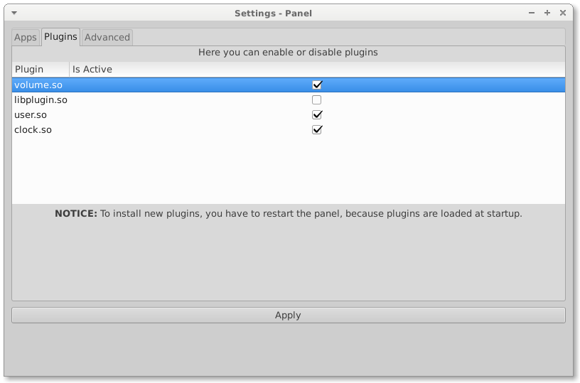
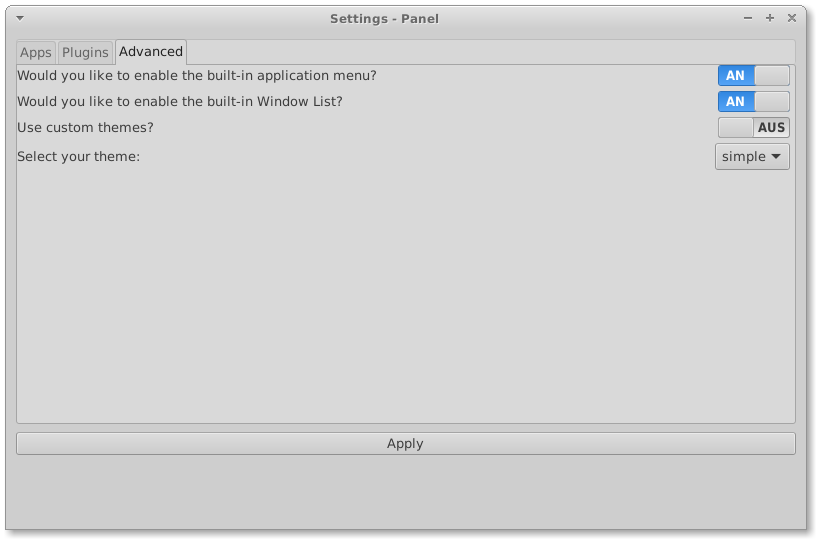
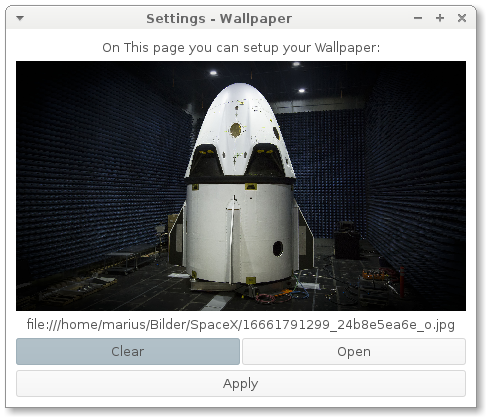

# Intro

This is the User-manual for SiDE.

## Panel

### Layout

The Panel is normally at the bottom of your screen.
It contains (left to right) a Application launcher,
your favorite Applications, a Window list which shows all hidden
windows and finally some Widgets.

It has a context menu (right-click) which has the following entries:

* Run (opens a run dialog)
* Open Terminal (opens the default terminal)
* Settings (opens the Panel settings)
* Logout (open a dialog to end session)

### Options

To save the changes press the Apply button.

#### Apps

In the first entry box, you can choose your terminal. Please note,
the terminal command must have an `&` at the end or the panel
will freeze as long as the terminal is open.

Secondly, in the list widget you can add or delete favorite applications
which should be shown in the panel. You have to fill in three fields:

* __Path__ (the command of the app like `gedit &` or `google-chrome &`. Again, remember the `&`)
* __Icon__ (which icon should be used? Nomaly this is the application name in lowercase letters)
* __Enabled__ (Should the application be displayed?)

Clear will delete _all_  favorite applications.

#### Plugins

In the list, you can select the plugins, which the Panel should load
on startup. Plugins extend the function of the panel. The panel comes with
a few pre-installed plugins like `clock.so` or `user.so`. `libplugin.so` should
not be enabled, because it is a example for developers on how to create
plugins.

You can simply enable plugins via checking the __Is Active__ box.

If you want to add new plugins you have to put the .so file in:

`/usr/lib/jetspace/panel/plugins/`.

As you can see, to enable new plugins you have to restart your session (or the panel).
The simplest way to do this is to logout and login again.

### Advanced

On this page you can simply enable some built-in features of the Panel:

* The application menu
* and the window list

You should only do this if you use a plugin which replaces them.

But you can also choose custom themes. This themes must be located in `/usr/share/themes/`
and contain a valid theme (`side-panel`).

To use a theme, enable the switch and select one from the list below.

# Wallpaper

### Layout

The Wallpaper service is currently quite simple. It displays the Wallpaper ;)
and provides a basic context menu:

* Run (run dialog, see [above](#panel))
* Change Wallpaper (opens the wallpaper settings)
* Log Out (end session, see [above](#panel))

### Options

Here you can simply change the Wallpaper (like the [SpaceX Dragon](http://spacex.com/dragon)). Use
Open to load a file browser, where you can select an image to use as background.

__Note:__ The Image is scaled, so it should fit more or less the resolution of your screen,
otherwise you will get bad results.

Use clear to remove the current Wallpaper and use an empty window as background.
