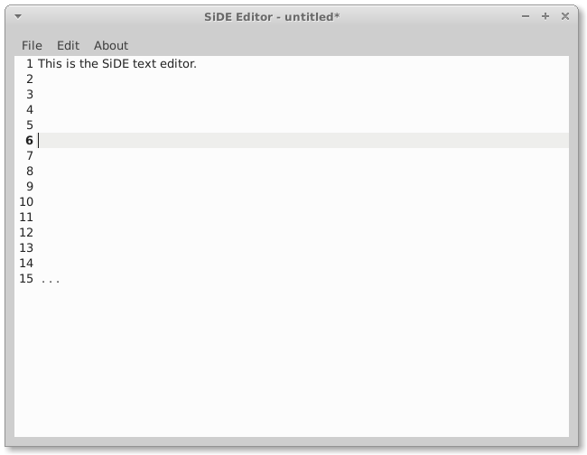

### Layout

This is how the editor looks like:

You have a menu and the text editing part. Also, the title bar is displaying some infos:

* Filename (or `untitled`)
* Indicator if file was changed (`*`)

The Text area highlights the current line and will also show line numbers.

### Features

* Indicate file changing
* Line Highlighting
* Line Numbers
* show matching brackets
* save window position + size
* warning if work would be lost

### Shortcuts

Key             | Action        |
:-----------:   | :-----------: |
CTRL + S        | Save          |
CTRL + SHIFT + S| Save as       |
CTRL + N        | New           |
CTRL + o        | Open          |
CTRL + Z        | Undo          |
CTRL + Y        | Redo          |
CTRL + ,        | Settings      |
SHIFT + F1      | Help          |
