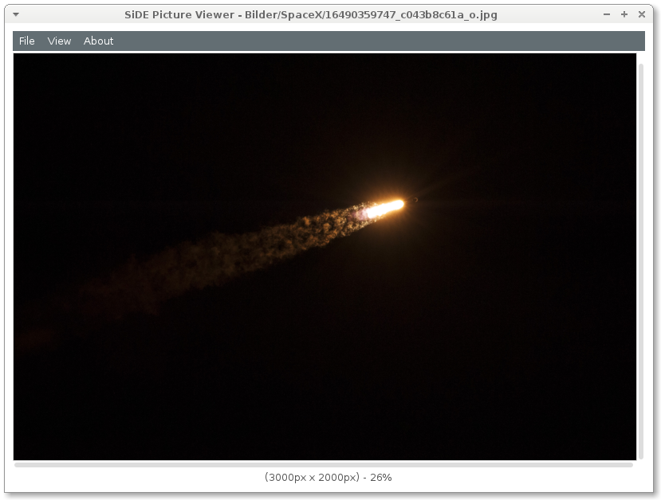

SiDE Picture Viewer
===================

Functions
---------

- Based on GdkPixbuf lib, so it can open almost every (image) file!
- Zooming / Fitting

Shortcuts
---------

=====  =====  ======
    Keys      Function
------------  ------
 Mod    Key
=====  =====  ======
CTRL     F     Fit image
CTRL     `+`     Zoom in
CTRL     `-`     Zoom out
CTRL     0     Original size
CTRL     o     Open Image
SHIFT    F1    Open help
=====  =====  ======
